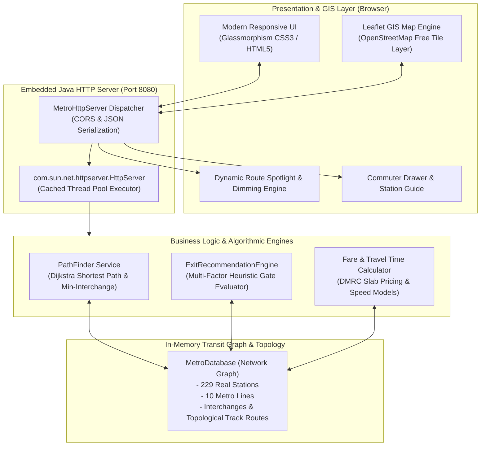
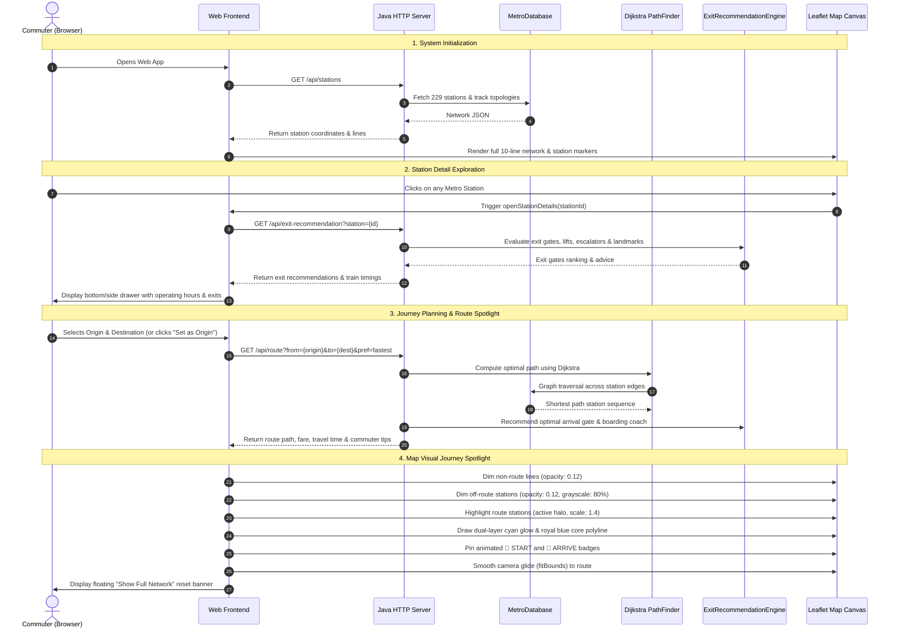

# Delhi Metro Navigator 🚇☕
> **Modern Java 21 Rapid Transit Navigation & Commuter Travel Companion**

Delhi Metro Navigator is a responsive, humanised transit mapping and route-planning platform built on a lightweight **pure Java 21 backend** and a **Leaflet GIS client powered by 100% free OpenStreetMap tiles** (zero external API keys required).

---

## 🏛️ System Architecture

The application follows a clean, decoupled **Layered Client-Server Architecture** designed for high throughput, sub-millisecond response times, and zero external framework bloat.



### Architectural Components

1. **Presentation & GIS Layer (Client)**:
   - **Interactive GIS Map**: Rendered using Leaflet.js with OpenStreetMap Carto tiles, providing responsive pan, zoom, and station exploration without Google Maps API keys or billing.
   - **Route Spotlight Engine**: Dynamically dims non-route lines and stations when a journey is planned, rendering glowing dual-layer polylines and animated `🚩 START` and `🏁 ARRIVE` badges.
   - **Commuter Companion Drawer**: Displays operating hours, first/last train timings, escalator/elevator availability, and street-level landmark exit guides.

2. **Embedded Java Server Layer**:
   - Implemented using Java standard library `com.sun.net.httpserver.HttpServer`.
   - Uses an optimized thread pool (`Executors.newCachedThreadPool()`) capable of handling concurrent transit queries with sub-millisecond latency.
   - Features built-in CORS headers, MIME-type recognition, and static file serving.

3. **Algorithmic & Business Logic Layer**:
   - **PathFinder**: Implements **Dijkstra's Shortest Path Algorithm** with support for dual optimization objectives:
     - *Fastest Route*: Minimizes physical transit travel time between stations.
     - *Fewer Transfers*: Adds penalty weights to interchange transitions to prefer direct line routes.
   - **ExitRecommendationEngine**: Evaluates station exits based on street landmark accessibility, elevator availability, walking distances, and nearby auto/bus feeder connections.
   - **Fare Matrix Calculator**: Applies official DMRC distance and slab pricing rules.

4. **In-Memory Transit Data Layer**:
   - **MetroDatabase**: Pre-indexes all 10 Delhi Metro lines (*Red, Yellow, Blue, Green, Violet, Pink, Magenta, Grey, Airport Express*) and 229 operational stations with exact GPS coordinates, track sequences, and interchange walking connections.

---

## 💻 Tech Stack

| Domain | Technology | Purpose & Rationale |
| :--- | :--- | :--- |
| **Backend Core** | **Java 21 (JDK 21 LTS)** | Pure object-oriented architecture, strong typing, low memory footprint, and zero external framework overhead. |
| **Web Server** | **Java Standard HTTP Server (`com.sun.net.httpserver`)** | Built directly into the Java runtime; requires no Tomcat, Spring Boot, or external servlet container. |
| **Routing Algorithm** | **Dijkstra's Algorithm (Adjacency Graph)** | Guarantees optimal pathfinding with configurable edge weights for time and transfer counts. |
| **Frontend Framework** | **Modern Vanilla ES6+ & HTML5** | High-performance client-side rendering with zero bundle compile step or heavy npm dependencies. |
| **Styling & Theme** | **Modern CSS3 (Glassmorphism & Flexbox/Grid)** | Clean aesthetic with dark mode map styling, responsive drawer panels, and mobile-first layout. |
| **Geospatial & Maps** | **Leaflet.js (v1.9.4)** | Lightweight, mobile-friendly interactive mapping library. |
| **Map Tiles Provider** | **OpenStreetMap (OSM)** | 100% free, community-driven map tiles with no API key quotas, rate limits, or billing dependencies. |
| **Icons** | **Lucide Icons** | Clean transit, safety, and directional vector iconography. |
| **Hosting & Deploy** | **Vercel (Static Web) / Java CLI Daemon** | Seamless hybrid static web delivery on Vercel CDN paired with standalone Java executable backend. |

---

## 🔄 End-to-End Application Flow

The following sequence illustrates how commuter queries flow from interaction to graph traversal and map rendering:



### Detailed Flow Phases

1. **Initialization & Topology Rendering**:
   - On page load, the frontend issues a single asynchronous request to `GET /api/stations`.
   - The Java backend returns all 229 station nodes along with polyline coordinates for all 10 lines.
   - Leaflet draws the complete Delhi Metro network with line-specific official colors (Yellow, Blue, Red, Pink, Magenta, etc.).

2. **Commuter Station Inspection**:
   - Clicking any station node on the map opens the Station Guide drawer.
   - The app fetches `/api/exit-recommendation?station={id}`.
   - The commuter views the first & last train timings, interchange connections, street landmarks, and gate accessibility (elevators/escalators).

3. **Journey Calculation**:
   - When the user selects starting and destination stations (or taps *"Set as Origin / Destination"*), the journey planner triggers.
   - The backend runs Dijkstra's algorithm across the transit graph, calculating total travel time, fare, and stop count.

4. **Dynamic Route Spotlight & Map Isolation**:
   - Rather than cluttering the screen with the whole city's network, the map isolates the selected journey:
     - All 9 non-participating lines are dimmed down to subtle background guides.
     - Intermediate stations on the journey light up with high-contrast glowing rings.
     - A dual-layer glowing polyline highlights the exact track path.
     - Custom pins mark the departure (`🚩 START`) and arrival (`🏁 ARRIVE`) points.
     - The camera automatically adjusts bounds (`fitBounds`) to center the journey.

5. **Full Network Reset**:
   - Commuters can tap **"Show Full Network"** on the floating banner at any time to instantly restore all 10 lines and 229 stations to full color and reset the view.

---

## 📡 REST API Reference

### 1. Get Network Stations & Topology
- **Endpoint**: `GET /api/stations`
- **Description**: Returns all 229 stations with GPS coordinates, line affiliations, interchange metadata, and line track order.
- **Sample Response**:
  ```json
  {
    "success": true,
    "stations": [
      {
        "id": "rajiv_chowk",
        "name": "Rajiv Chowk",
        "lines": ["Yellow Line", "Blue Line"],
        "lat": 28.6328,
        "lng": 77.2195,
        "isInterchange": true,
        "firstTrain": "05:45",
        "lastTrain": "23:30"
      }
    ],
    "lineRoutes": {
      "Yellow Line": ["samaypur_badli", "kashmere_gate", "rajiv_chowk", "hauz_khas", "millennium_city_centre_gurugram"]
    }
  }
  ```

### 2. Plan Trip / Route Calculation
- **Endpoint**: `GET /api/route?from={originId}&to={destId}&pref={fastest|fewest_interchanges}`
- **Description**: Computes the optimal path, travel time, stops, fare, and AI commuter tips.
- **Sample Response**:
  ```json
  {
    "success": true,
    "route": {
      "originId": "rajiv_chowk",
      "destId": "hauz_khas",
      "originName": "Rajiv Chowk",
      "destName": "Hauz Khas",
      "totalTimeMins": 28,
      "totalStops": 9,
      "fare": 30,
      "recommendedCoach": "Coach 2-3 (Optimal Platform Exit)",
      "pathStationIds": [
        "rajiv_chowk", "patel_chowk", "central_secretariat", "udyog_bhawan",
        "lok_kalyan_marg", "jor_bagh", "dilli_haat_ina", "aiims", "green_park", "hauz_khas"
      ],
      "exitAi": {
        "bestGate": "Gate 2",
        "reason": "Direct access to IIT Delhi Main Gate with ramp access.",
        "savedMins": 7,
        "lift": true,
        "transitOptions": ["Auto Stand", "Bus Bay"]
      }
    }
  }
  ```

### 3. Station Exit & Accessibility Recommendations
- **Endpoint**: `GET /api/exit-recommendation?station={stationId}`
- **Description**: Evaluates all gates of a station and suggests the best street exit.

---

## 🛠️ Compilation & Local Setup

### Prerequisites
- **Java JDK 17** or **JDK 21+**
- Git

### Build & Run

1. **Clone the repository**:
   ```bash
   git clone https://github.com/WhiffGodd/Delhi-Metro-Navigator.git
   cd Delhi-Metro-Navigator
   ```

2. **Compile Java classes into bytecode**:
   ```powershell
   javac -d bin src/com/delhimetro/model/*.java src/com/delhimetro/service/*.java src/com/delhimetro/server/*.java src/com/delhimetro/*.java
   ```

3. **Start the embedded Java server**:
   ```powershell
   java -cp bin com.delhimetro.Main
   ```

4. **Access the application**:
   Open **`http://localhost:8080`** in your browser.

---

## 🚨 Safety & Commuter Features

- **Emergency Helplines**: One-tap dialing for Delhi Police (`112`), Metro Police Helpline (`1511`), CISF Metro Security (`155655`), Women's Safety Helpline (`1091`, `181`), and Divyangjan Wheelchair Escort (`155370`).
- **DMRC Smart Card Recharge**: Integrated online top-up redirection to `dmrcsmartcard.com` with quick-select amount chips (₹100, ₹200, ₹500, ₹1000).
- **Zero API Key Requirement**: Full Leaflet GIS mapping powered by OpenStreetMap contributors.

## Static hosting and station data

Static hosts (including the current Vercel deployment) do not run the Java server.
The app tries the Java station API first and falls back to `data/stations.json`
so the map, station search, line filters, station timings, and dropdowns still work.
Route calculations run in the browser when the Java server is absent or the route API fails.
Both fastest-route and fewest-transfers preferences work using the bundled topology.
Times include a five-minute transfer allowance; fares retain the app's existing
stop-based estimate model and are labeled estimates, not current official fares.
Exit recommendations still require the Java server.

The Vaishali branch is included as a separate service in the route graph.
Network reference: [DMRC map](https://delhimetrorail.com/static/media/DMRC-Network-Map_Jan2026_Hindi-English-13.03.2026.147097c4.pdf).

The bundled data is exported from `MetroDatabase`, not a separate hand-maintained
station list. After updating the Java database, compile the source as described
above and regenerate the bundle:

```powershell
java -cp bin scripts/ExportStationNetwork.java
node --test tests/*.test.cjs
```

Commit the regenerated `data/stations.json` along with database changes.

## Journey companion

Plan a route and select **Start my journey** to track your ride manually. Use
**Reached next stop** as you arrive at each station. The companion shows the next
station, remaining stops, journey progress, and an approaching-transfer reminder.
**Previous stop** corrects an accidental tap; **Reset** returns to the start.
Planning a different route resets tracking. This feature does not use GPS or live
train updates, and progress is not saved when the page is reloaded.

The roadmap and journey legs use the site's charcoal and sand palette while
retaining metro line colours on the tracks and line labels.
